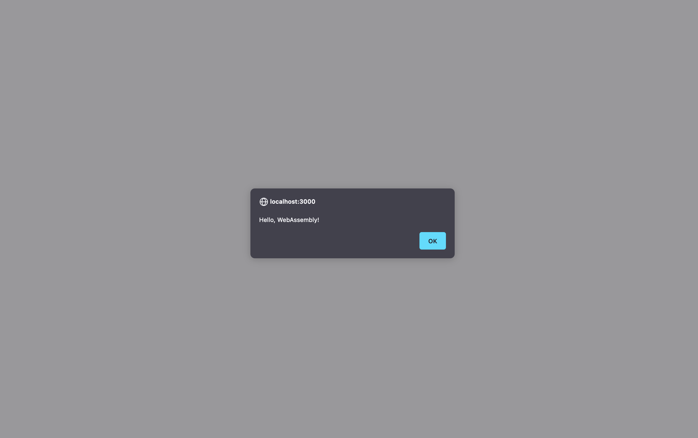
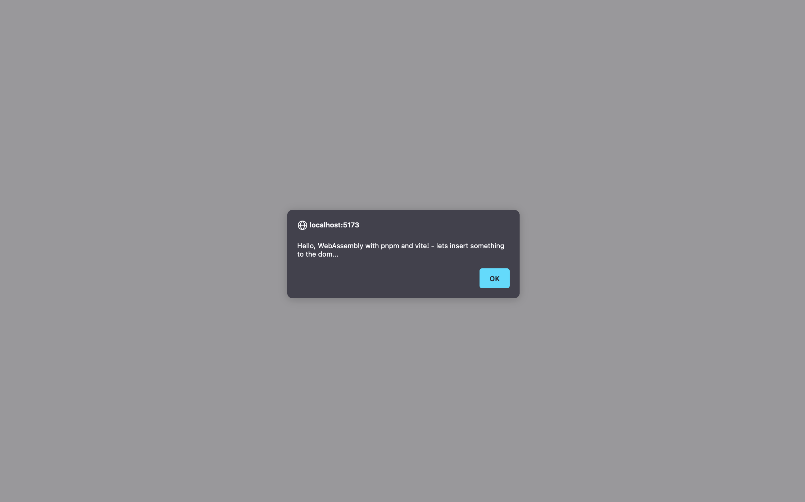
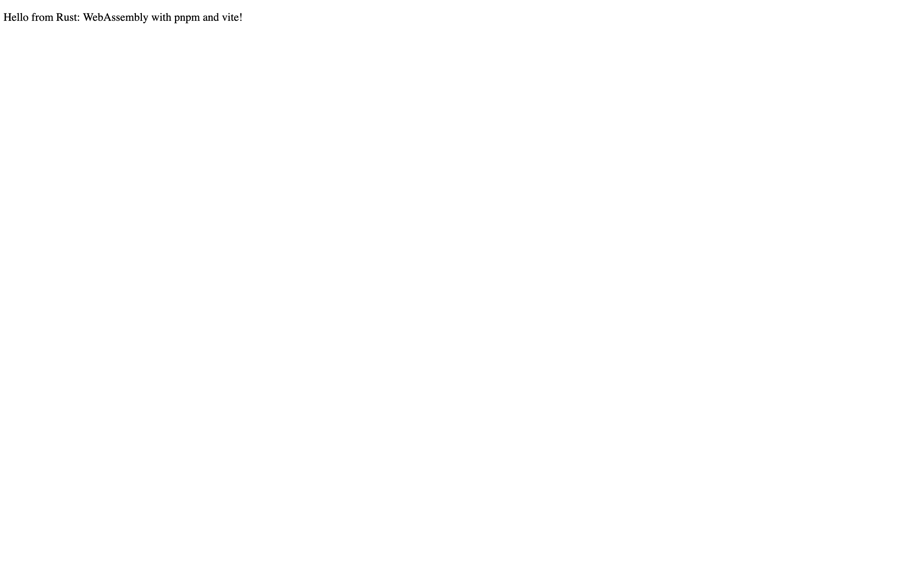

# Description

This projects contains my experiments for learning WebAssembly with Rust.

## Status

- [ ] _in progress_
- [x] _finished_
- [ ] _no longer continued_

# Installation

- Rust (rustup -> rustc, cargo)
- wasm-pack (https://rustwasm.github.io/wasm-pack/installer/)
- optional: cargo generate for ('cargo install cargo-generate' for 'cargo generate --git https://github.com/rustwasm/wasm-pack-template')
or a perhand setup: cargo new --lib hello-wasm (see. https://developer.mozilla.org/en-US/docs/WebAssembly/Rust_to_wasm)

# Build a Project:
To build a project, checkout its readme.md file.

Mostly:
- wasm-pack build --target web
- wasm-pack build --target nodejs
- wasm-pack build --target bundler

And then serving the html via serve or a bundler like vite/webpack...

# Loading Wasm web
- now you can open the generated /pkg file in the browser:

# wasm-game-of-life

A wasm game of life inplementation, with drawing, zooming, starting and stopping the rendering.

# hello-wasm
A minimal example of 'wasm-pack build --web' loaded inside vanilla javascript calling javascripts alert funktion from WebAssembly using <a href="https://crates.io/crates/wasm-bindgen">wasm_bindgen</a>

```rust
use wasm_bindgen::prelude::*;

#[wasm_bindgen]
extern "C" {
    pub fn alert(s: &str);
}

#[wasm_bindgen]
pub fn greet(name: &str) {
    alert(&format!("Hello, {name}!"));
}
```

# hello-wasm-bundler
A minimal exampe of 'wasm-pack build --bundler' loaded inside of a vite project. Minimal DOMManipulation example using web_sys wasm_bindgen bindings<a href="https://crates.io/crates/web-sys">web-sis</a>



```rust
use wasm_bindgen::prelude::*;

#[wasm_bindgen]
extern "C" {
    pub fn alert(s: &str); // bind to the browsers javascript alert function
}

#[wasm_bindgen]
pub fn greet(name: &str) -> Result<(), JsValue> {
    alert(&format!(
        "Hello, {name}! - lets insert something to the dom..."
    ));

    // the web_sys crate contains predefined extern "C" byindings to most existing web-apis like
    // window, document, body, etc.
    let window = web_sys::window().expect("no global `window` exists");
    let document = window.document().expect("should have a document on window");
    let body = document.body().expect("document should have a body");

    // Manufacture the element we're gonna append
    let val = document.create_element("p")?;
    val.set_inner_html(&format!("Hello from Rust: {name}!"));

    body.append_child(&val)?;

    Ok(())
}
```


# Resources

Those are beatiful tutorials i used to get started:

- https://rustwasm.github.io/book/
- https://rustwasm.github.io/docs/wasm-bindgen/
- https://rustwasm.github.io/docs/wasm-pack/
- https://developer.mozilla.org/en-US/docs/WebAssembly/Rust_to_wasm
